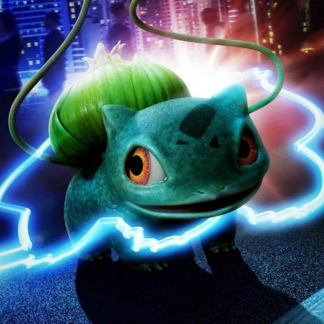
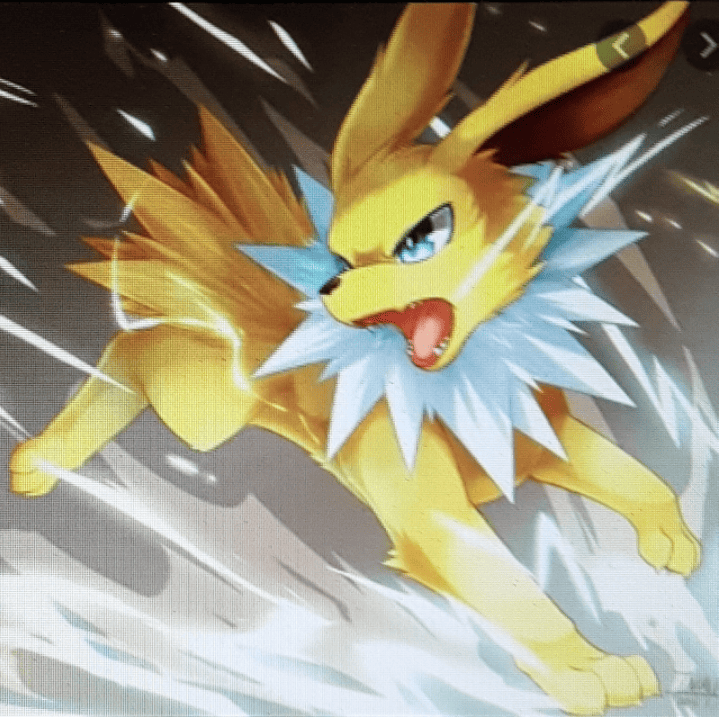

# pokedex-ar

## 🚀 Projeto
Um identificador de imagens de Pokemon! Tire uma foto e descubra mais sobre seu Pokemon preferido!

## 🛠️ Tecnologias
- [React Native](https://reactnative.dev)
- [Expo](https://expo.dev)

## 🌎 Desempenho pelo mundo
Publicado na Google Play Store em janeiro de 2019, foi mantido até junho de 2022. Nesse período, o app teve mais de **100 mil downloads** ao redor do mundo, sendo usado para identificar mais de **460 mil fotos!**

  

  

* Mapa de downloads do app. Atualizado em janeiro de 2021

## 📱 O App

  
  
  

  
  
  

## 🗂️ Galeria
Uma prévia de alguns Pokemons encontrados pelos treinadores ao redor do mundo!

  
  
  
  

  
  
  
  

  
  
  
  

  
  
  
  

  
  
  
  

